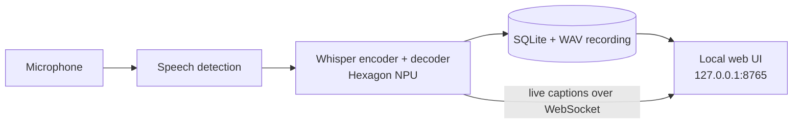

# Kalvi: offline AI lecture companion for Snapdragon PCs

Kalvi (கல்வி, Tamil for *learning*) turns classroom lectures into live captions, searchable
transcripts and study material, entirely on a Snapdragon-powered HP laptop. Every AI model runs
on the Hexagon NPU. No audio or text leaves the device, and it works in classrooms with no Wi-Fi.

## Status

| Feature | Status |
| --- | --- |
| Whisper speech recognition on the Snapdragon NPU (ONNX Runtime QNN) | Done |
| NPU vs CPU benchmark (latency, tokens/s, real-time factor, battery drain) | Done |
| Live captions from the microphone, with on-device speech detection | Done |
| Local lecture library: SQLite transcripts plus the full recording | Done |
| Import an existing recording (for example from a phone) | Done |
| Click a caption to replay that moment of the lecture; keyword search | Done |
| Board Snap: whiteboard photos to text with TrOCR | Planned (week 3) |
| Notes, flashcards and quizzes with Llama 3.2 3B on the NPU | Planned (week 4) |
| Doubt Replay: semantic search over lectures with Nomic-Embed-Text | Planned (week 5) |
| One-click Windows installer | Planned (week 6) |

## How it works



* **Speech detection first.** An energy-based voice activity detector cuts the audio into
  phrases, so Whisper works on whole sentences and silence never reaches the NPU.
* **Qualcomm AI Hub Whisper.** Kalvi uses the `precompiled_qnn_onnx` Whisper export from
  [Qualcomm AI Hub](https://aihub.qualcomm.com/models/whisper_base). The decoder has static
  shapes and an explicit KV cache so it can run on the NPU; `kalvi/asr/whisper_onnx.py`
  implements the greedy decoding loop against that exact interface and reads the model
  dimensions from the graph, so Whisper Base, Small and Large-V3-Turbo all work.
* **No PyTorch at runtime.** The log-mel spectrogram is computed in NumPy
  (`kalvi/asr/features.py`) and matches Hugging Face's `WhisperFeatureExtractor` to within
  1e-4. The install on the laptop stays small and ARM64-friendly.
* **Fair benchmark.** The CPU baseline is the same Qualcomm Whisper graph exported as float
  ONNX, so NPU and CPU run identical models.
* **Local only.** The server listens on `127.0.0.1`; the browser is just the UI.

## Setup on a Snapdragon X PC

You need Windows 11 on Snapdragon (for example an HP OmniBook or EliteBook with Snapdragon X).

1. **Install native ARM64 Python.** Download the *Windows installer (ARM64)* for Python 3.11
   or 3.12 from [python.org](https://www.python.org/downloads/windows/). An x64 Python runs
   under emulation and cannot load the NPU provider.

2. **Install Kalvi's dependencies.**

   ```bat
   git clone https://github.com/<your-username>/kalvi.git
   cd kalvi
   py -3.11-arm64 -m venv .venv
   .venv\Scripts\activate
   pip install -r requirements.txt
   python scripts\check_env.py
   ```

   `check_env.py` reports whether each dependency loads on ARM64, whether the
   `QNNExecutionProvider` (NPU) is available and whether a microphone is found.

3. **Download the NPU model** (Whisper Base compiled for Snapdragon X Elite, plus tokenizer):

   ```bat
   python scripts\fetch_models.py
   ```

   Use `--info` to list the available assets, `--chipset qualcomm-snapdragon-x2-elite` for
   X2 Elite, or `--model whisper_large_v3_turbo` for the larger model.

4. **Run Kalvi.**

   ```bat
   run_kalvi.bat
   ```

   The browser opens at http://127.0.0.1:8765. The badge at the top right shows where the
   models run (*Snapdragon Hexagon NPU (QNN HTP)*).

Options: `python -m kalvi --device cpu`, `--language ta`, `--device mock` (UI without models).
The same settings can be set with the `KALVI_DEVICE`, `KALVI_LANGUAGE` and `KALVI_MODELS_DIR`
environment variables.

## Benchmark: NPU vs CPU

1. Export the CPU baseline once, in an **x64** Python (Qualcomm's `qai_hub_models` package
   does not install on ARM64 Python). This can be done on any PC; copy `models\whisper_base\cpu`
   to the laptop afterwards.

   ```bat
   pip install -r requirements-export.txt
   python scripts\export_cpu_baseline.py
   ```

2. On the Snapdragon PC, in the ARM64 environment, run the benchmark with a real lecture clip:

   ```bat
   python scripts\benchmark.py --audio samples\lecture_clip.wav
   python scripts\benchmark.py --audio samples\lecture_clip.wav --power-minutes 10
   ```

   The second command also measures battery drain during 10 minutes of continuous
   transcription per device (unplug the charger first).

Results are saved to `benchmarks/results.md` and `benchmarks/results.json`, and appear in
the app. **Paste `benchmarks/results.md` here after running it on the laptop:**

<!-- BENCHMARK RESULTS -->
*Not yet measured on hardware.*

## Project structure

```
kalvi/
  asr/
    features.py       Whisper log-mel spectrogram in NumPy
    tokenizer.py      Whisper tokenizer (tokenizers library, offline)
    whisper_onnx.py   Encoder + KV-cache decoder loop for AI Hub Whisper
    audio.py          Loading, resampling, 30 s chunking
  runtime.py          ONNX Runtime sessions on the NPU (QNN HTP) or CPU
  capture.py          Microphone stream and speech segmentation
  recorder.py         Live lectures and file import (capture -> ASR -> store)
  store.py            SQLite lecture store
  server.py           FastAPI server, REST API and WebSocket events
  benchmark.py        NPU vs CPU measurements
  static/             Web UI (HTML, CSS, JS)
scripts/
  check_env.py        Is this machine ready?
  fetch_models.py     Download AI Hub NPU models
  export_cpu_baseline.py  Export the CPU baseline model
  benchmark.py        Run the benchmark
tests/                pytest suite (runs anywhere, no model download needed)
```

## Tests

```bat
pip install -r requirements-dev.txt
python -m pytest
```

The suite builds tiny ONNX models with exactly the same inputs and outputs as the AI Hub
Whisper export (in float32 and float16), so the real decoding loop, KV-cache handling,
speech segmentation, storage, server and WebSocket events are tested without downloading
any weights.

## Roadmap

| Week | Milestone |
| --- | --- |
| 1 | Whisper on the NPU, live captions, first benchmark |
| 2 | Lecture timeline, storage and UI |
| 3 | Board Snap: TrOCR on the NPU, board text on the timeline |
| 4 | Notes, flashcards and quizzes with Llama 3.2 3B (GenieX) |
| 5 | Doubt Replay: Nomic-Embed-Text semantic search, jump to the moment |
| 6 | Windows installer, benchmark dashboard, demo video |

## Privacy

Kalvi has no accounts, analytics or network calls at runtime. Lectures are stored in the
`data/` folder on the laptop and can be deleted from the app at any time.

## Acknowledgements

* [Qualcomm AI Hub Models](https://github.com/qualcomm/ai-hub-models) for the NPU-optimised Whisper export
* [OpenAI Whisper](https://github.com/openai/whisper) (MIT licence)
* [ONNX Runtime](https://onnxruntime.ai/) and its QNN execution provider

## Licence

MIT. See [LICENSE](LICENSE).
